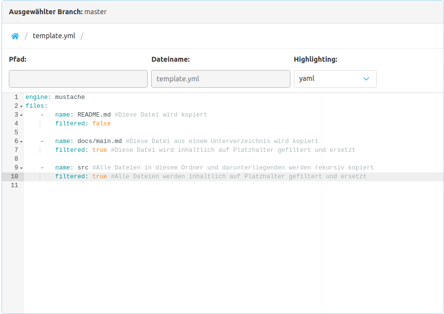
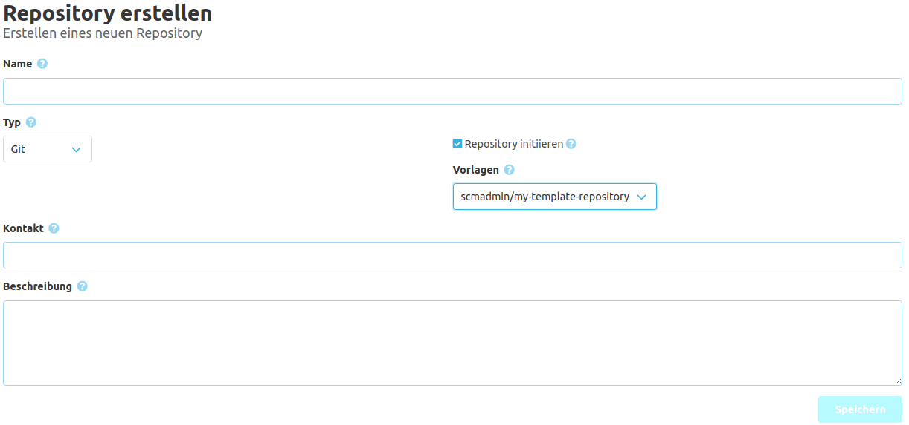

Um ein Repository als Vorlage nutzen zu können, muss innerhalb des Repository eine `template.yml` 
im Root Verzeichnis des Main Branches angelegt werden. Diese `template.yml` definiert welche Dateien 
aus dem Vorlage-Repository kopiert werden sollen und welche Engine zum Verarbeiten des Dateiinhalts verwendet werden soll.
Die Engine ersetzt Platzhalter beim Kopieren durch den entsprechenden Wert aus dem Kontext.

Die folgenden Platzhalter stehen zur Verfügung:
- repository.namespace
- repository.name
- repository.type
- repository.contact
- repository.description
- repository.id

Die Standard Engine ist [mustache](https://mustache.github.io/) und das Standard Encoding ist `UTF-8`, 
falls keine andere Werte gesetzt wurde.

Die Template Yaml muss ein Feld `files` enthalten, wo Dateien als Array angegeben werden.
Eine einzelne Datei muss die Felder `path` (Pfad innerhalb des Vorlagen-Repository) 
und `filtered` (soll der Inhalt der Datei templated werden). Wird bei `path` ein Verzeichnis angegeben, 
werden alle Datei innerhalb dieses Verzeichnisses kopiert und getemplated.
Optional können noch eine Template Engine und ein Encoding angegeben werden.

Beispiel:
```yaml 
engine: mustache
encoding: UTF-8
files: 
    -   path: README.md
        filtered: true
    -   path: src/main
        filtered: false
```



Beispiel einer zu verarbeitenden Datei für die Mustache Engine (hier eine pom.xml):
```xml
<?xml version="1.0" encoding="UTF-8"?>
<project xmlns="http://maven.apache.org/POM/4.0.0" xmlns:xsi="http://www.w3.org/2001/XMLSchema-instance"
	xsi:schemaLocation="http://maven.apache.org/POM/4.0.0 http://maven.apache.org/xsd/maven-4.0.0.xsd">
  <modelVersion>4.0.0</modelVersion>

  <groupId>com.example.{{repository.name}}</groupId>
  <artifactId>{{repository.name}}</artifactId>
  <version>0.0.1-SNAPSHOT</version>
  <packaging>pom</packaging>

  <name>{{repository.name}}</name>
  <description>{{repository.description}}</description>
    
  <scm>
    <developerConnection>scm:{{repository.type}}:https://example.com/scm/repo/projects/{{repository.name}}</developerConnection>
  </scm>

</project>
```

Aus einem bestehenden Repository und der dazugehörigen Verzeichnisstruktur heraus können Benutzer mit Push-Berechtigung über die Schaltfläche "Template Repository" in den Repository-Einstellungen ein Template erzeugen. 

Nachdem ein Repository als Vorlage definiert wurde, kann man es für die Initialisierung bei der Repository Erstellung auswählen.


