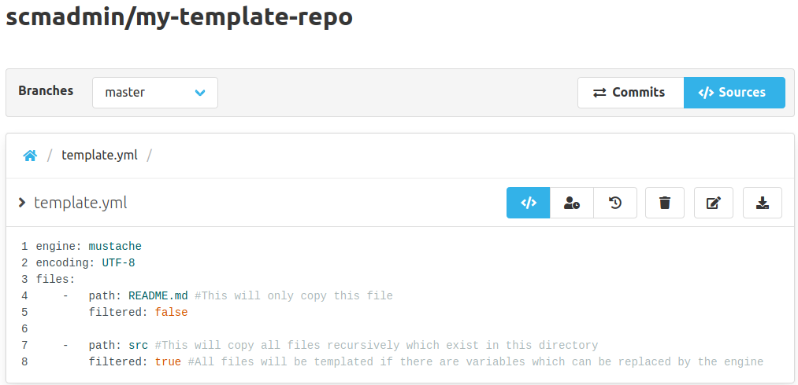
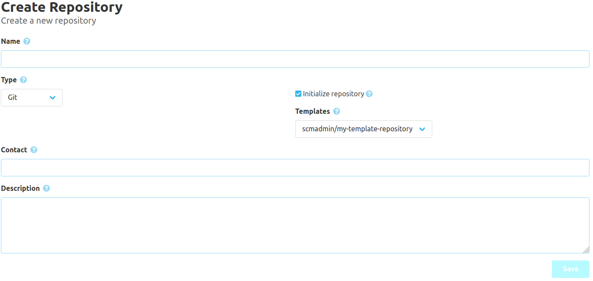

To use a repository as a template you must simply add a `template.yml` file to the root directory on the main branch. 
This `template.yml` defines which files should be copied from the template to the target repository 
and if their content should be templated using a template engine. 

The default template engine is [mustache](https://mustache.github.io/) and the default encoding is `UTF-8` if nothing else is defined.

The template yaml must contain a field `files` with contains all files as an array.
Each file must have the fields `path` (file path in repository) and `filtered` (should file content be templated)
If you use a directory path all files inside will be copied and templated (if set true).
Additional you may choose a custom template engine or another encoding. 

Example:
```yaml 
engine: mustache
encoding: UTF-8
files: 
    -   path: README.md
        filtered: true
    -   path: src/main
        filtered: false
```



After a repository got marked as template it is available on the repository creation if you check `initialize repository`.


